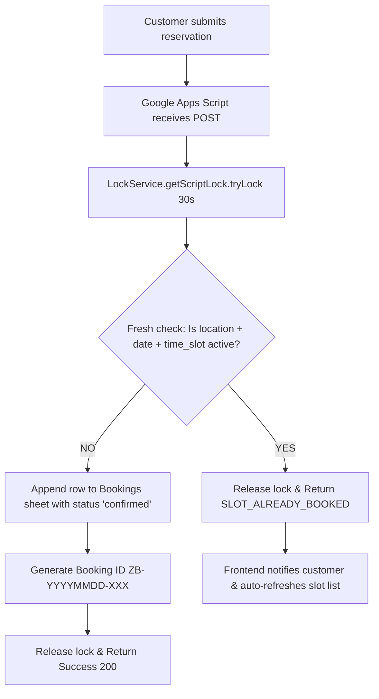

# 🎂 Zelebrae Pastries — Celebration Point Booking Application

A modern, responsive, mobile-first reservation web application for **Zelebrae Pastries Celebration Point** (Ashokapuram, Kozhikode).

Replaces long Google Forms with a progressive, delightful celebration booking experience while preserving the authentic Zelebrae brand identity.

---

## 🌟 Key Highlights & Architecture

- **No Traditional Server to Maintain**: The frontend is a static Vite + React single-page application easily deployable to Vercel, Netlify, or Cloudflare Pages.
- **Google Sheets as Database**: Bookings, available time slots, celebration locations, party combos, and amenities are stored directly in Google Sheets.
- **Google Apps Script Web App**: Acts as the secure, lightweight data-access and booking layer with **zero secrets** exposed to client browsers.
- **Double-Booking Protection**: Utilizes Google Apps Script `LockService` to atomically verify slot availability and write bookings, eliminating simultaneous race conditions.
- **Zelebrae Visual Identity**:
  - Deep Purple (`#4A1E5F`)
  - Warm Celebration Cream Backgrounds (`#FAF8F5`, `#F5EFE6`)
  - Vibrant Emerald Green CTA elements (`#1B8755`)
  - Elegant Typography: *Playfair Display* for headlines & *Plus Jakarta Sans* for crisp UI controls.
  - Authentic imagery: Integrated Zelebrae Celebration Point photograph (`hero.webp`) and official guidelines poster (`Guidelines.jpg`).
- **Mobile-First UX**: Large touch targets (48px+), sticky bottom navigation bar, single primary CTA, responsive calendar, and one-handed slot selection.
- **Built-in Interactive Demo Mode**: The application runs completely and interactively out-of-the-box (even before connecting Google Sheets), with realistic slot bookings, double-booking handling, and persistent session storage.

---

## 📱 Multi-Step Booking Flow

1. **Celebration Location**: High-resolution showcase of Zelebrae celebration points across Kozhikode (**Pantheerankavu**, **Karaparamba**, **Ashokapuram**, and **Arakkinar**) with capacity badges, addresses, and amenities overview.
2. **Occasion & Guests**: Visual cards (Birthday 🎂, Anniversary 💍, Bride to Be 👰, Groom to Be 🤵, Mom to Be 🍼, Other Milestone 🎉) and quantity stepper `[-] 4 Guests [+]` with capacity limits.
3. **Date & Available Time**: Interactive calendar month view with Asia/Kolkata date calculations, disabled past dates, and dynamic slot schedule (**09:30 AM to 08:30 PM**). Booked slots are clearly visible with a **Booked** tag and disabled/non-clickable state.
4. **Customize**: Multi-select amenity cards (Decorations, Music & Mic, AC Hall, Welcome Drinks) and celebration party packs with a *"View full combo menu"* modal.
5. **Customer Details**: Name, Customer City/Area, WhatsApp number with India (+91) country selector and phone validation, optional email, and requirements.
6. **Review & Guidelines**: Receipt-style celebration summary with section edit triggers, Celebration Area Guidelines expandable modal featuring `Guidelines.jpg` with 14 rules, and mandatory agreement checkbox.
7. **Success Screen**: Confetti celebration animation, unique Booking ID (`ZB-YYYYMMDD-XXX`), one-tap official WhatsApp chat with pre-filled details, and *"Add to Calendar"* (`.ics`) integration.

---

## 🚀 Quick Start (Local Development)

### 1. Prerequisites
- Node.js (v18 or v20+)
- npm

### 2. Install & Start Development Server
```bash
# Clone or navigate to the directory
cd "c:/Optigo Works/zelebrae-form"

# Install dependencies
npm install

# Start local development server (runs on http://localhost:3000)
npm run dev
```

### 3. Production Build & Preview
```bash
# Type check and build production bundle
npm run build

# Preview production build locally
npm run preview
```

---

## 📊 Google Sheets & Google Apps Script Setup Guide

Follow these simple steps to connect the booking application to your live Google Sheets database:

### Step 1: Create a New Google Spreadsheet
1. Open [Google Sheets](https://sheets.new) in your browser.
2. Name the sheet: **`Zelebrae Celebration Bookings`**.

### Step 2: Open Google Apps Script
1. In the top menu, click **Extensions** → **Apps Script**.
2. Rename the project from "Untitled project" to **`Zelebrae Booking API`**.

### Step 3: Paste the API Code
1. Open the file [`google-apps-script/Code.gs`](./google-apps-script/Code.gs) in this repository.
2. Copy the entire content and paste it into the `Code.gs` editor in Apps Script, replacing any default template code.
3. Click **Save** (Ctrl+S / Cmd+S).

### Step 4: Run One-Click Sheet Initialization
1. In the Apps Script toolbar, select the function **`setupInitialSheets`** from the function dropdown.
2. Click **Run**.
3. Google will ask for authorization on the first run:
   - Click *Review permissions*
   - Choose your Google account
   - Click *Advanced* → *Go to Zelebrae Booking API (unsafe)*
   - Click *Allow*
4. In a few seconds, look at your Google Spreadsheet! All **6 sheets** (`Bookings`, `Locations`, `Slots`, `Combos`, `Amenities`, `Settings`) will be created and pre-filled with styled headers and sample data!

### Step 5: Deploy as Web App
1. At the top right of the Apps Script editor, click **Deploy** → **New deployment**.
2. Click the gear icon next to "Select type" and choose **Web app**.
3. Fill in the deployment details:
   - **Description**: `Zelebrae Celebration API v1`
   - **Execute as**: **Me** (`your-email@gmail.com`)
   - **Who has access**: **Anyone** *(Important: Allows the frontend to read availability and submit bookings without customer Google login)*
4. Click **Deploy**.
5. Copy the **Web App URL** provided (it looks like: `https://script.google.com/macros/s/AKfycbx.../exec`).

---

## 🌐 Deploying Frontend to Vercel / Netlify

### Environment Variable
Create an environment variable in your Vercel or Netlify project settings:

```ini
VITE_BOOKING_API_URL=https://script.google.com/macros/s/AKfycbx.../exec
```

### Deploy to Vercel (CLI)
```bash
# Deploy with Vercel CLI
npx vercel

# Or push your repository to GitHub and import it on vercel.com
```

> **Note**: When `VITE_BOOKING_API_URL` is configured, the application automatically talks to Google Sheets. If left empty, it runs in interactive Demo Mode!

---

## 🔒 Concurrency & Double-Booking Protection

Double-booking is prevented using a two-tier strategy:



1. **Frontend Availability**: Available slots for the selected date are dynamically loaded from Google Sheets.
2. **Server-Side Locking**: When a customer confirms, Google Apps Script acquires an exclusive script lock via `LockService.getScriptLock().tryLock(30000)`.
3. **Atomic Collision Check**: The `Bookings` sheet is freshly examined for any booking matching `location + date + time_slot` where `status` is `confirmed` or `pending`.
4. **Race Resolution**: If another customer booked that millisecond, the lock ensures the second request receives `{ "success": false, "error": "SLOT_ALREADY_BOOKED" }`. The frontend immediately shows a friendly message and refreshes available slots.

---

## 📂 Project Structure

```
zelebrae-form/
├── google-apps-script/
│   ├── Code.gs                # Production Google Apps Script Web App endpoint
│   └── sheets_schema.md       # Full 6-sheet schema & data dictionary
├── public/
│   ├── Guidelines.jpg         # Official celebration guidelines poster
│   └── hero.webp              # Authentic Zelebrae celebration photograph
├── src/
│   ├── components/
│   │   ├── Header.tsx         # Brand header with logo & WhatsApp link
│   │   ├── ProgressStepper.tsx# Step indicator bar with backward jumping
│   │   ├── StepLocation.tsx   # Screen 1: Celebration Point card
│   │   ├── StepOccasionGuests.tsx # Screen 2: Occasions & guest stepper
│   │   ├── StepDateTime.tsx   # Screen 3: Interactive calendar & slots
│   │   ├── StepCustomize.tsx  # Screen 4: Amenities & party combos
│   │   ├── ComboMenuModal.tsx # Full combo menu detail modal
│   │   ├── StepCustomerDetails.tsx # Screen 5: Name, phone (+91), email, notes
│   │   ├── StepReview.tsx     # Screen 6: Summary & guidelines checkbox
│   │   ├── GuidelinesModal.tsx# Guidelines poster & 14 rules modal
│   │   ├── SuccessScreen.tsx  # Confetti, Booking ID, WhatsApp, Calendar
│   │   └── MobileBottomBar.tsx# Sticky bottom action bar for mobile
│   ├── config/
│   │   └── constants.ts       # Locations, occasions, slots, amenities, combos
│   ├── services/
│   │   └── bookingApi.ts      # API client + robust offline Mock Engine
│   ├── styles/
│   │   ├── variables.css      # Zelebrae brand colors, fonts, elevation tokens
│   │   ├── global.css         # Reset, typography, animations, focus styles
│   │   └── components.css     # Component-specific styles
│   ├── types/
│   │   └── booking.ts         # TypeScript data contracts & models
│   ├── utils/
│   │   └── dateUtils.ts       # Asia/Kolkata timezone & calendar logic
│   ├── App.tsx                # Main controller & state orchestrator
│   └── main.tsx               # Application entry point
├── index.html                 # SEO meta, font preloading, viewport settings
├── package.json
├── tsconfig.json
├── vite.config.ts
└── README.md
```

---

## 🍰 Brand Assets

- **Guidelines Poster**: [`public/Guidelines.jpg`](./public/Guidelines.jpg) — Official 14 rules of the Zelebrae celebration point.
- **Hero Photography**: [`public/hero.webp`](./public/hero.webp) — Real celebration moment at Zelebrae Pastries.
